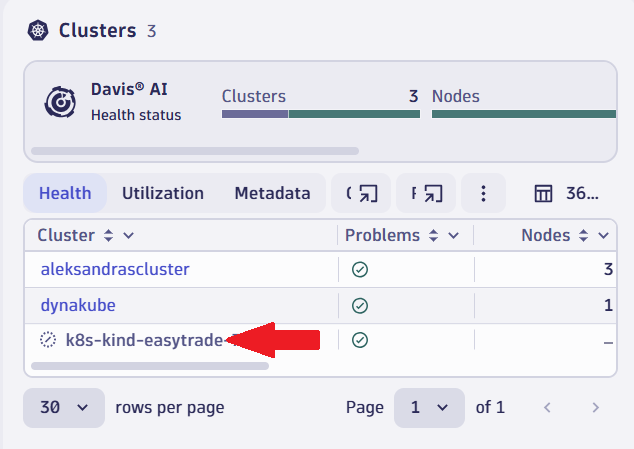
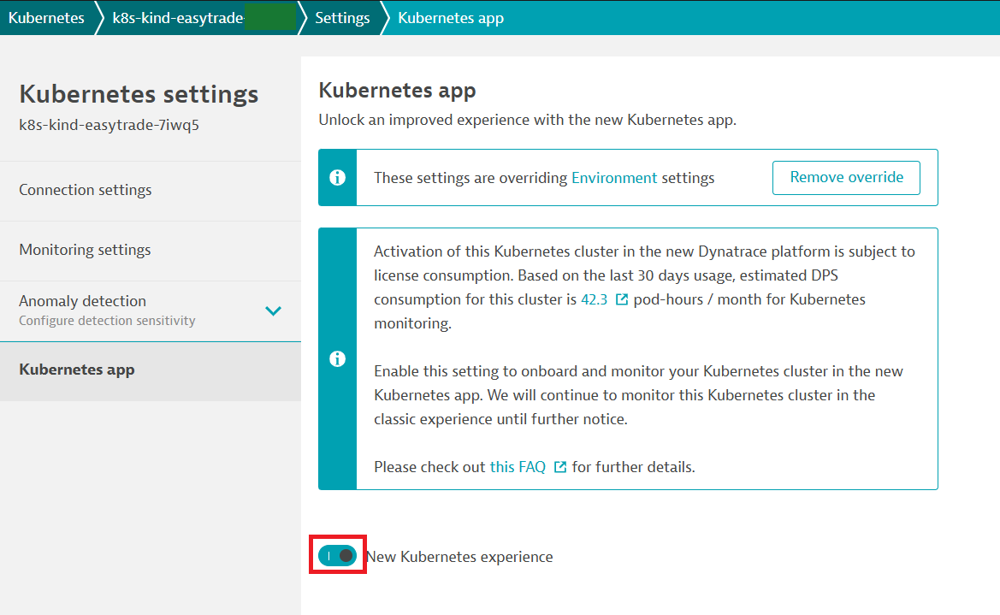
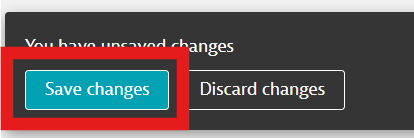
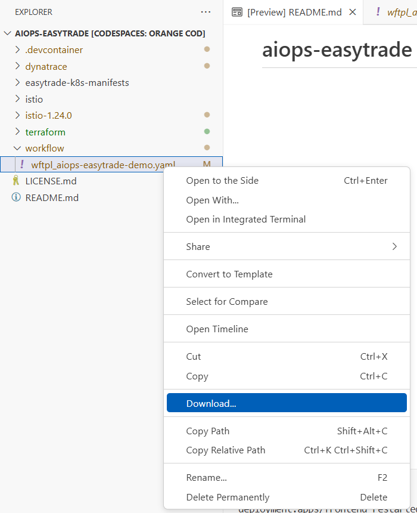
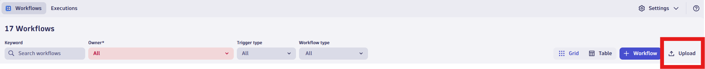
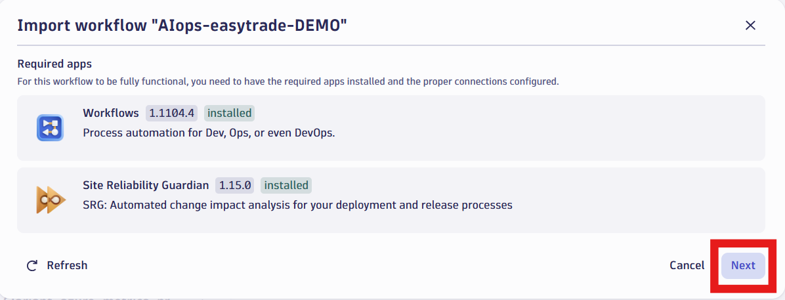
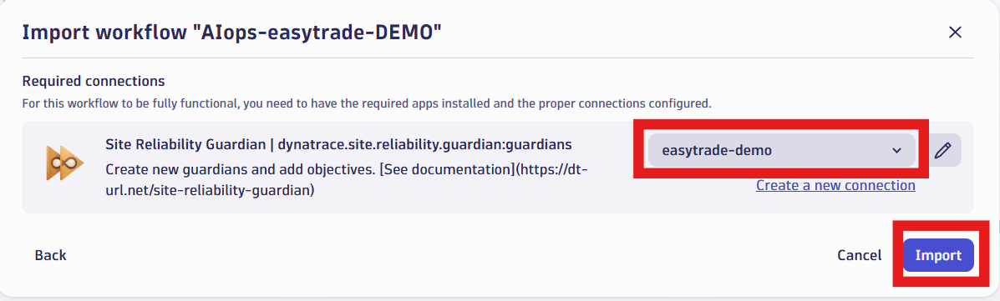

## Dynatrace Gui

### Activate k8s metric collection
Under the new kubernetes app select the cluster:  

  

Enable the new kubernetes experience:  

  

  

Import the OrderController failure scenario workflow:

