## Codespaces Cluster Set Up

Create a new instance or use an existing instance of the `aiops-easytrade` Codespaces.

[aiops-easytrade](https://github.com/dt-wv/aiops-easytrade/tree/main)

Navigate to the Github repository.  Click on `Code`.  Click on `Codespaces`.  Click on `New with options`.

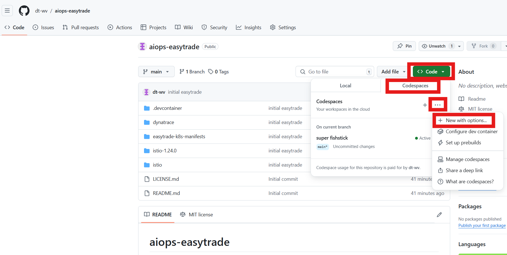

Choose the Branch `code-spaces`.  Choose the Dev Container Configuration `Kubernetes in Codespaces`.

Choose a Region near your Dynatrace tenant.

Choose Machine Type `4-core`.

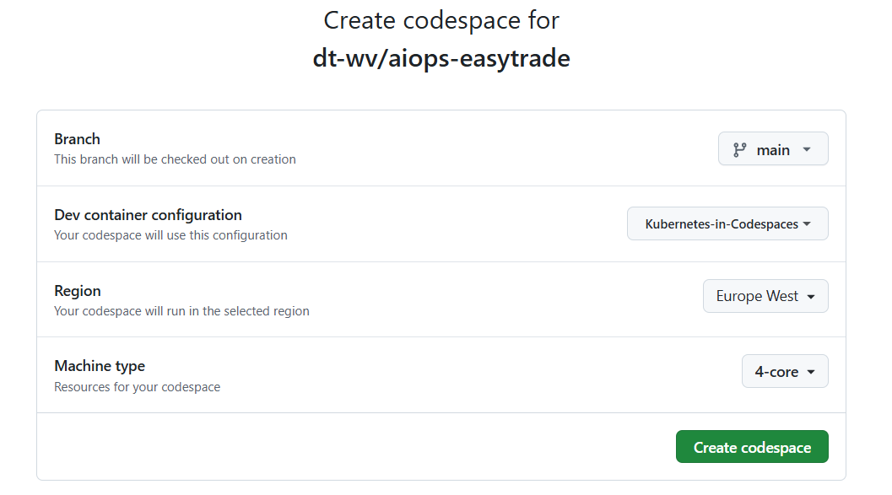

Allow the Codespace instance to fully initialize.  It is not ready yet.


The Codespace instance will run the post initialization scripts.


The Codespaces require the input of the previously created API Tokens and OAuth Client.  

  

Enable port-forwarding to the reverseproxy webfrontend

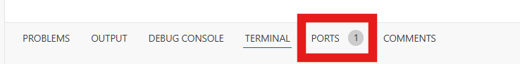

Hover over the ***private*** visibility of the port and right click.

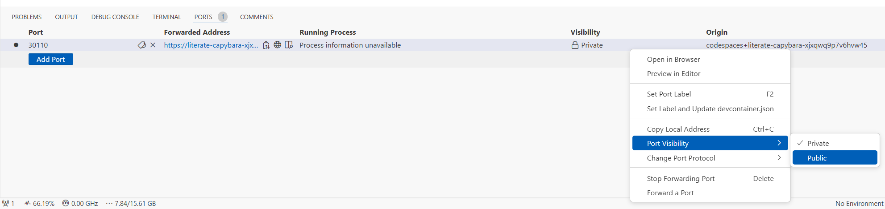  

Put it on ***Public***  

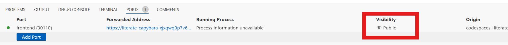  


Cick on the globe in the Forwarded Address link.  

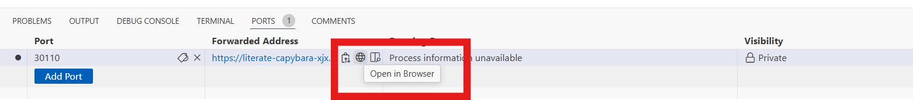  

This will open a new browser tab with a report on a unsafe page.

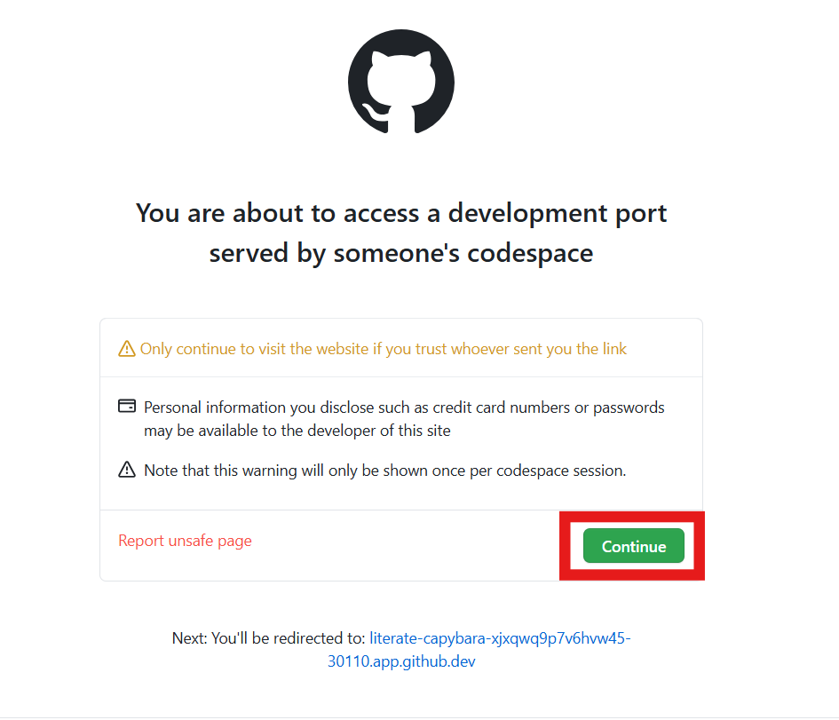

When the Codespace instance is idle, validate the `easytrade` pods are running.

Command:
```sh
kubectl get pods -n easytrade
```

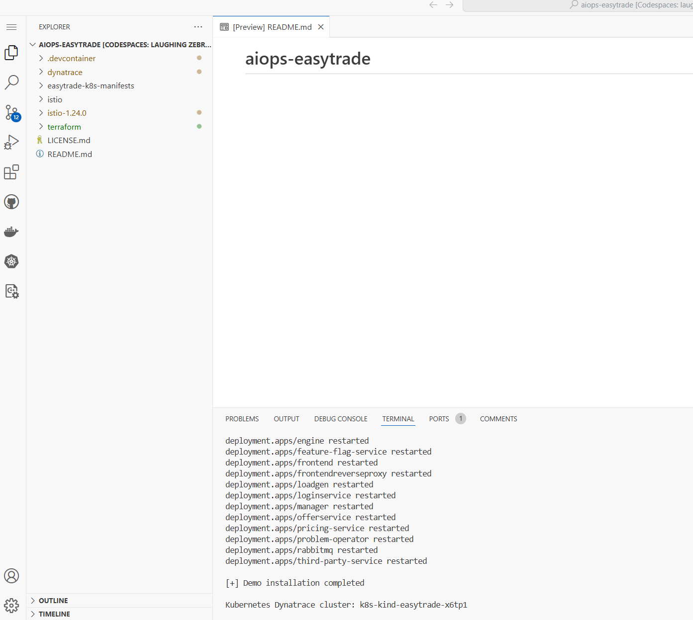

Put the codespaces idle timer to ***240*** minutes.  

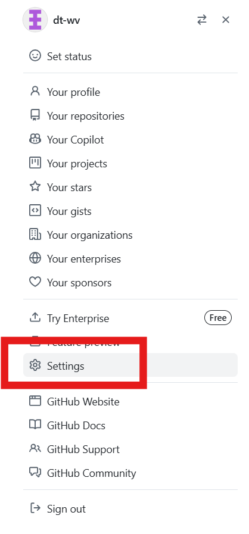

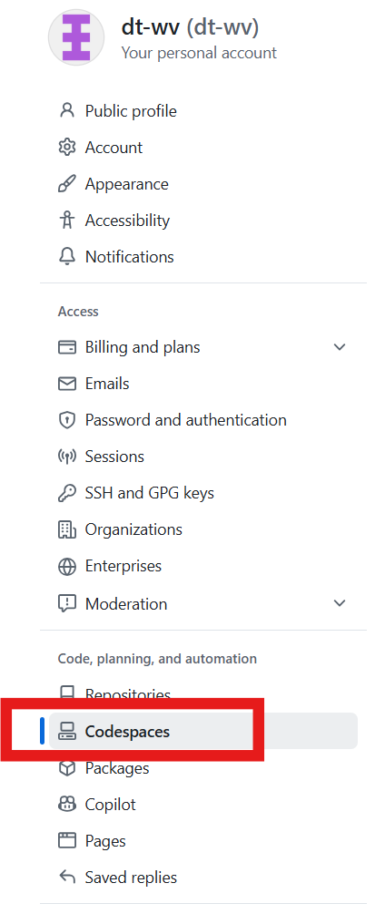

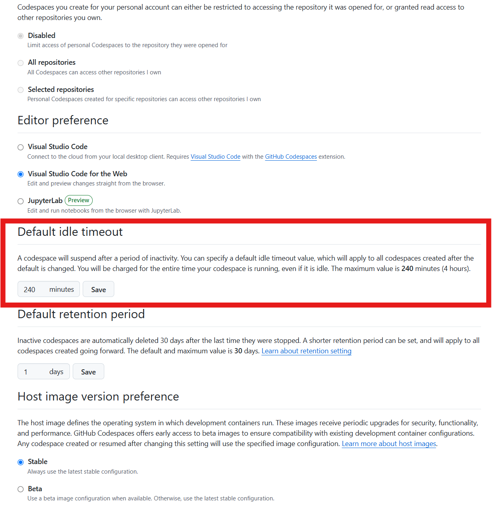